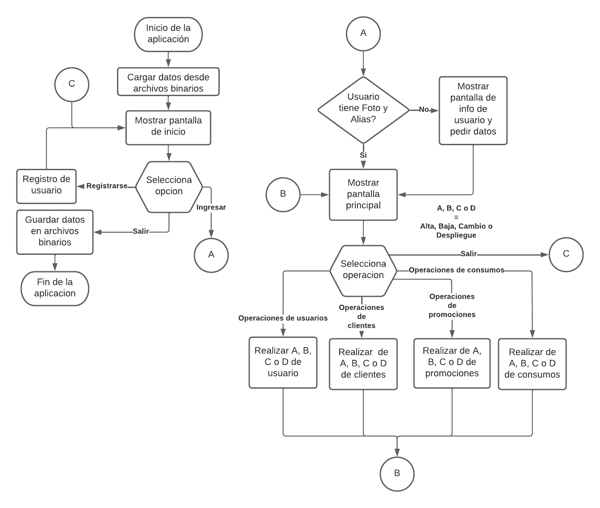
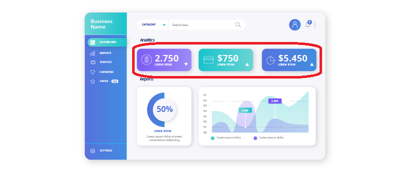

# `APLICACIÓN PARA ADMINISTRACIÓN DE CLIENTES FRECUENTES`

Proyecto para la materia de Programación Avanzada de LMAD

## `INTRODUCCIÓN`

Se debe desarrollar una aplicación para poder gestionar las compras hechas en un negocio así como los clientes que asisten realizar alguna compra o consumo, además debe ser posible generar promociones que se aplicaran a los clientes cuando realicen alguna compra dependiendo de la cantidad de compras que hayan hecho anteriormente.

**`Comercios`** : Se requiere su uso para múltiples comercios, donde un comercio puede ser una tienda, restaurante, barber shop, bar, spa, etc. 

**`Usuarios`** : Cada comercio debe tener al menos un usuario tipo administrador y puede tener cero o más usuarios tipo cajero. La diferencia entre un administrador y un cajero reside en las operaciones o acciones que puede ejecutar en el sistema; un administrador tiene acceso a todas las pantallas del sistema, mientras que un cajero tiene ciertas restricciones sobre operaciones.

**`Clientes`** : Los clientes son personas que van a realizar alguna compra o consumo a un negocio, cuyos datos son registrados en el sistema para poder rastrear su consumo y poder ofrecerles promociones que estén activas cuando haga un consumo o compra.

**`Promociones`** : Una promoción consta de un descuento al consumo de un cliente cuando reúne cierta cantidad de compras o consumos en el comercio.

**`Consumos`** : Son los registros de compras que han hecho clientes en un negocio.

____________________________

## `LISTADO DE OPERACIONES`

Las operaciones que se pueden realizar son las siguientes:

### **`Operaciones iniciales`**
- Inicio de sesión
- Registrar usuario administrador

### **`Operaciones principales`**
- Usuarios
  - Alta de usuario _(ADMIN)_
  - Actualizar usuario _(ADMIN Y CAJERO)_
  - Baja de usuario _(ADMIN)_
  - Restablecer contraseña  _(ADMIN)_
  - Listado de usuarios _(ADMIN Y CAJERO)_
- Clientes
    - Alta de cliente  _(ADMIN Y CAJERO)_
    - Actualizar cliente _(ADMIN Y CAJERO)_
    - Baja de clientes _(ADMIN)_
    - Listado de clientes _(ADMIN Y CAJERO)_
- Promociones
    - Alta de promoción _(ADMIN Y CAJERO)_
    - Baja de promoción _(ADMIN)_
    - Listado de promociones  _(ADMIN Y CAJERO)_
- Consumos
    - Alta de consumos _(ADMIN Y CAJERO)_
    - Listado de consumos _(ADMIN Y CAJERO)_
- Salir _(ADMIN Y CAJERO)_

A muy _grosso modo_ el diagrama de flujo es el siguiente:

____________________________

## `REQUERIMIENTOS POR PANTALLA`

### _`REGLAS GENERALES`_

- _Cuando alguna de las reglas de validación no se cumplan se debe mostrar un mensaje de error indicando dicho error._
- _Si se trata de guardar información en pantallas donde se necesita seleccionar previamente un registro, pero no ha sido seleccionado ninguno, debe mostrarse una alerta que indique que no se ha seleccionado un dato._

### `PANTALLA DE INICIO DE SESIÓN`

Esta debe ser la primera pantalla en aparecer. Contendrá los siguientes campos:

| Campo             | Descripción                                                                               | Requerido |
| ----------------- | ----------------------------------------------------------------------------------------- | --------- |
| Comercio          | Este campo puede ser un campo abierto un listado con los comercios que se han registrado. | Si        |
| Nombre de usuario | Usuario que va a iniciar sesión.                                                          | Si        |
| Contraseña        | Contraseña del usuario. Debe usarse un campo tipo password para ocular la contraseña.     | Si        |

Esta pantalla deberá contar con 3 botones:

| Botón             | Descripción                                                                                                                                                                                                                                                   |
| ----------------- | ------------------------------------------------------------------------------------------------------------------------------------------------------------------------------------------------------------------------------------------------------------- |
| Iniciar sesión    | Al dar clic en el botón de _Iniciar sesión_, se deben validar las credenciales y el comercio ingresado contra los atos registrados previamente. En caso de fallo, se debe mostrar una alerta que indicando que las credenciales son inválidas.                |
| Registrar usuario | Al dar clic en el botón de _Registrar usuario_ se navegará a la pantalla de _Registro de usuario_.                                                                                                                                                            |
| Salir             | Al dar clic en el botón de _Salir_, se debe preguntar al usuario si desea realmente cerrar la aplicación, en caso de aceptar, se guardarán todos los datos en memoria a un archivo. En caso de cancelar la operación, la aplicación se mantiene en ejecución. |
___________________________

### ` PANTALLA DE REGISTRO DE USUARIO ADMINISTRADOR.`

En esta pantalla se debe poder agregar un nuevo usuario y sus credenciales para entrar a la aplicación. Contendrá los siguientes campos:

| Campo             | Reglas                                                                                                                                                                                          | Requerido |
| ----------------- | ----------------------------------------------------------------------------------------------------------------------------------------------------------------------------------------------- | --------- |
| Comercio          | Longitud de 5 a 15 caracteres alfanuméricos o espacios.                                                                                                                                         | Si        |
| Nombre de usuario | Solamente se permiten letras, máximo 15.                                                                                                                                                        | Si        |
| Contraseña        | Mínimo 3 y máximo 10 caracteres, se debe solicitar una letra, un número y un carácter especial como mínimo, si no cuenta on estos requisitos entonces será considerada una contraseña inválida. | Si        |

Esta pantalla deberá contar con 3 botones:

| Botón             | Descripción                                                                                  |
| ----------------- | -------------------------------------------------------------------------------------------- |
| Registrar usuario | Se almacenan los datos registrados y se regresa a la pantalla de _Iniciar sesión_.           |
| Regresar          | Descarta los cambios en la pantalla y regresa al usuario a la pantalla principal u anterior. |

____________________________

### ` PANTALLA PRINCIPAL`

Esta pantalla deberá contar con un formato tipo Dashboard, es decir, un recuadro con un número grande y texto pequeño indicando que significa ese número. 

Así mismo, esta pantalla contendrá el menú para administradores o para cajeros dependiendo del tipo de usuario que haya iniciado sesión. Deberá mostrarse los siguientes campos estáticos:
- La cantidad de clientes.
- La cantidad de promociones activas.
- La cantidad de promociones inactivas.
- La cantidad de consumos totales.
- El monto total de consumo de todos los clientes.

Todos estos datos deben ser únicamente del comercio al que pertenece el usuario actual.

____________________________

### ` PANTALLAS DE USUARIO`

#### **`Actualizar usuario (ADMIN Y CAJERO)`**

Si es la primera vez que un usuario (administrador o cajero) inicia sesión y su información de usuario se encuentra vacía, esta es la primera pantalla que debe mostrarse para llenar la información. Si no fuera el caso anterior, dicha pantalla debe de poder accederse igualmente para realizar modificaciones.

Los campos que se deben capturar son:

| Campo             | Reglas                                                         | Requerido |
| ----------------- | -------------------------------------------------------------- | --------- |
| Nombre completo   | Solo caracteres alfabéticos y espacios, mínimo 5 y máximo 50   | Si        |
| Alias del usuario | Solo se permite caracteres alfanuméricos, mínimo 3 y máximo 10 | No        |
| Foto              | Cargar una imagen de perfil para el usuario                    | Si        |

Esta pantalla sirve para que un usuario actualice su propia información.

Esta pantalla contará con los siguientes botones:

| Texto del botón | Descripción                                                                                  |
| --------------- | -------------------------------------------------------------------------------------------- |
| Guardar         | Almacena los cambios de la información.                                                      |
| Regresar        | Descarta los cambios en la pantalla y regresa al usuario a la pantalla principal u anterior. |
____________________________

#### **`Alta de nuevo usuario (ADMIN)`**

Los usuarios tipo administrador pueden dar de alta a otros administradores o cajeros.

Los campos que se deben capturar son:
| Campo             | Reglas                                                                                                                                                                                          | Requerido |
| ----------------- | ----------------------------------------------------------------------------------------------------------------------------------------------------------------------------------------------- | --------- |
| Comercio          | Este campo debe estar prellenado con el mismo comercio del administrador, es de solo lectura.                                                                                                   | Si        |
| Nombre de usuario | Solo caracteres alfabéticos y espacios, mínimo 5 y máximo 50                                                                                                                                    | Si        |
| Contraseña        | Mínimo 3 y máximo 10 caracteres, se debe solicitar una letra, un número y un carácter especial como mínimo, si no cuenta on estos requisitos entonces será considerada una contraseña inválida. | Si        |
| Tipo de usuario   | Para este campo puede ser un listado, radio buttons pero no campos de textos, ya que se le debe indicar al usuario los tipos disponibles sin dejar que los edite                                | Si        |

Esta pantalla contará con los siguientes botones:

| Texto del botón | Descripción                                                                                  |
| --------------- | -------------------------------------------------------------------------------------------- |
| Guardar         | Almacena los cambios de la información.                                                      |
| Regresar        | Descarta los cambios en la pantalla y regresa al usuario a la pantalla principal u anterior. |
____________________________

#### **`Listado de usuarios (ADMIN)`**

Esta pantalla consta de dos partes, en la parte izquierda de la pantalla se mostrará un listbox donde se desplieguen todos los usuarios del mismo comercio que el usuario actual, mientras que en la parte derecha se mostrará toda la información del usuario (en formato de solo lectura) que se seleccione al momento de dar clic en algún usuario del listbox de la parte izquierda.

Esta pantalla contará con los siguientes botones:

| Texto del botón | Descripción                                                                                  |
| --------------- | -------------------------------------------------------------------------------------------- |
| Actualizar      | Dirige al usuario a una pantalla para actualizar el registro seleccionado.                   |
| Eliminar        | Dirige al usuario a una pantalla para eliminar el registro seleccionado.                     |
| Regresar        | Descarta los cambios en la pantalla y regresa al usuario a la pantalla principal u anterior. |
____________________________

#### **`Reestablecer contraseña (ADMIN)`**

En esta pantalla los usuarios administradores tendrán la capacidad de restablecer la contraseña de algún otro usuario, incluso la propia contraseña del usuario administrador.

Esta pantalla consta de dos partes, en la parte izquierda de la pantalla se mostrará un listbox donde se desplieguen todos los usuarios del mismo comercio que el usuario actual, mientras que en la parte derecha se mostrará un campo editable el cual servirá para editar la contraseña del usuario seleccionado del listbox.

Esta pantalla contará con los siguientes botones:

| Texto del botón        | Descripción                                                                                  |
| ---------------------- | -------------------------------------------------------------------------------------------- |
| Restablecer contraseña | Sobreescribe la contraseña del usuario seleccionado.                                         |
| Regresar               | Descarta los cambios en la pantalla y regresa al usuario a la pantalla principal u anterior. |
___________________________

### ` PANTALLAS DE CLIENTES`

#### **`Alta de clientes (ADMIN Y CAJERO)`**

En esta pantalla se podrá capturar la información de un nuevo cliente. 

Los campos que se deben capturar son:

| Campo    | Reglas                                                                                        | Requerido |
| -------- | --------------------------------------------------------------------------------------------- | --------- |
| Nombre   | Solo caracteres alfabéticos y espacios, mínimo 5 y máximo 50                                  | Si        |
| Alias    | Solo caracteres alfabéticos y espacios, mínimo 5 y máximo 15                                  | No        |
| Telefono | Solo caracteres numéricos, de exactamente 10 caracteres                                       | No        |
| Email    | Validacion de formato email, mínimo 5 y máximo 25                                             | Si        |
| Comercio | Este campo debe estar prellenado con el mismo comercio del administrador, es de solo lectura. | Si        |
| Fecha    | Este campo debe estar prellenado con la fecha del sistema, es de solo lectura.                | Si        |

Esta pantalla contará con los siguientes botones:

| Texto del botón | Descripción                                                                                  |
| --------------- | -------------------------------------------------------------------------------------------- |
| Guardar         | Almacena los cambios de la información.                                                      |
| Regresar        | Descarta los cambios en la pantalla y regresa al usuario a la pantalla principal u anterior. |
____________________________

#### **`Baja de clientes (ADMIN)`**

En esta pantalla el administrador podrá dar de baja a los clientes de su comercio. A esta pantalla se llega solamente a través del listado de clientes.

Se mostrarán campos en formato solo lectura donde se cargará la información del cliente que se seleccionó en la pantalla previa.

Esta pantalla contará con los siguientes botones:

| Texto del botón | Descripción                                                                                                                                                                                                                                                                                                                                                                             |
| --------------- | --------------------------------------------------------------------------------------------------------------------------------------------------------------------------------------------------------------------------------------------------------------------------------------------------------------------------------------------------------------------------------------- |
| Eliminar        | Al darle clic debe desplegarse un cuadro de mensaje que pregunte al usuario que si esta seguro que desea eliminar el cliente, icho cuadro de mensaje debe tener los botones de _Cancelar_ y _Aceptar_, donde al dar clic en _Aceptar_, se procede a borrar el registro e la aplicación. Si el usuario da clic en  _Cancelar_, la aplicación mantiene al usuario en la pantalla actual." |
| Regresar        | Descarta los cambios en la pantalla y regresa al usuario a la pantalla principal u anterior.                                                                                                                                                                                                                                                                                            |
____________________________

#### **`Listado de clientes (ADMIN Y CAJERO)`**

Esta pantalla consta de dos partes, en la parte izquierda de la pantalla se mostrará un listbox donde se desplieguen todos los clientes del mismo comercio que el usuario actual, mientras que en la parte derecha se mostrarán campos en formato solo lectura donde se cargará la información del cliente seleccionado en el listbox.

Esta pantalla contará con los siguientes botones:

| Texto del botón | Descripción                                                                                  |
| --------------- | -------------------------------------------------------------------------------------------- |
| Actualizar      | Dirige al usuario a una pantalla para actualizar el registro seleccionado.                   |
| Eliminar        | Dirige al usuario a una pantalla para eliminar el registro seleccionado.                     |
| Regresar        | Descarta los cambios en la pantalla y regresa al usuario a la pantalla principal u anterior. |
____________________________

#### **`Actualizar de clientes (ADMIN Y CAJERO)`**

En esta pantalla el administrador podrá modificar a los clientes de su comercio.

Esta pantalla consta de dos partes, en la parte izquierda de la pantalla se mostrará un listbox donde se desplieguen todos los clientes del mismo comercio que el usuario actual, mientras que en la parte derecha se mostrarán campos donde se cargará la información del cliente seleccionado en el listbox; dichos campos tendrán el siguiente comportamiento: 

| Campo    | Reglas                                                                                        | Requerido | Formato      |
| -------- | --------------------------------------------------------------------------------------------- | --------- | ------------ |
| Nombre   | Solo caracteres alfabéticos y espacios, mínimo 5 y máximo 50                                  | Si        | Solo lectura |
| Alias    | Solo caracteres alfabéticos y espacios, mínimo 5 y máximo 15                                  | No        | Editable     |
| Telefono | Solo caracteres numéricos, de exactamente 10 caracteres                                       | No        | Editable     |
| Email    | Validacion de formato email, mínimo 5 y máximo 25                                             | Si        | Editable     |
| Comercio | Este campo debe estar prellenado con el mismo comercio del administrador, es de solo lectura. | Si        | Solo lectura |
| Fecha    | Este campo debe estar prellenado con la fecha del sistema, es de solo lectura.                | Si        | Solo lectura |

Esta pantalla contará con los siguientes botones:

| Texto del botón | Descripción                                                                                  |
| --------------- | -------------------------------------------------------------------------------------------- |
| Guardar         | Almacena los cambios de la información.                                                      |
| Regresar        | Descarta los cambios en la pantalla y regresa al usuario a la pantalla principal u anterior. |
____________________________

### `PANTALLAS DE PROMOCIONES`

#### **`Alta de promoción (ADMIN)`**

En esta pantalla se podrá dar de alta promociones nuevas en la aplicación. 

La promoción debe tener un nombre para identificarla, la promoción será otorgada a los clientes que logren un monto de consumos definidas por alguna promoción, también debe tener un estatus para saber si la promoción está activa o inactiva. Si está inactiva, esta no podrá ser aplicada a los clientes.

Los campos que se deben capturar son:

| Campo                   | Reglas                                                                                                        | Requerido |
| ----------------------- | ------------------------------------------------------------------------------------------------------------- | --------- |
| Nombre                  | Solo caracteres alfabéticos y espacios, mínimo 5 y máximo 50                                                  | Si        |
| Monto para promociones  | Solo números no negativos menores a 100.                                                                      | Si        |
| Porcentaje de descuento | Cantidad decimal, mayor a 0 y menor a 100                                                                     | Si        |
| Estatus                 | Mostrar un listbox, un par de radio buttons o un checkbox para indicar si esta activa o inactiva la promoción | Si        |
| Fecha                   | Este campo debe estar prellenado con la fecha del sistema, es de solo lectura.                                | Si        |

Esta pantalla contará con los siguientes botones:

| Texto del botón | Descripción                                                                                  |
| --------------- | -------------------------------------------------------------------------------------------- |
| Guardar         | Almacena los cambios de la información.                                                      |
| Regresar        | Descarta los cambios en la pantalla y regresa al usuario a la pantalla principal u anterior. |
____________________________

#### **`Baja de promociones (ADMIN)`**

En esta pantalla el administrador podrá dar de baja promociones de su comercio.

Esta pantalla consta de dos partes, en la parte izquierda de la pantalla se mostrará un listbox donde se desplieguen todos las promociones del mismo comercio que el usuario actual, mientras que en la parte derecha se mostrarán campos en formato solo lectura donde se cargará la información de la promoción seleccionada en el listbox.

Esta pantalla contará con los siguientes botones:

| Texto del botón | Descripción                                                                                                                                                                                                                                                                                                                                                                               |
| --------------- | ----------------------------------------------------------------------------------------------------------------------------------------------------------------------------------------------------------------------------------------------------------------------------------------------------------------------------------------------------------------------------------------- |
| Eliminar        | Al darle clic debe desplegarse un cuadro de mensaje que pregunte al usuario que si esta seguro que desea eliminar la promoción, dicho cuadro de mensaje debe tener los botones de _Cancelar_ y _Aceptar_, donde al dar clic en _Aceptar_, se procede a borrar el registro de la aplicación. Si el usuario da clic en  _Cancelar_, la aplicación mantiene al usuario en la pantalla actual." |
| Regresar        | Descarta los cambios en la pantalla y regresa al usuario a la pantalla principal u anterior.                                                                                                                                                                                                                                                                                              |
____________________________

#### **`Listado de promociones (ADMIN Y CAJERO)`**

Esta pantalla consta de dos partes, en la parte izquierda de la pantalla se mostrará un listbox donde se desplieguen todos los clientes del mismo comercio que el usuario actual, mientras que en la parte derecha se mostrarán campos en formato solo lectura donde se cargará la información del cliente seleccionado en el listbox.

Esta pantalla contará con los siguientes botones:

| Texto del botón | Descripción                                                                                  |
| --------------- | -------------------------------------------------------------------------------------------- |
| Actualizar      | Dirige al usuario a una pantalla para actualizar el registro seleccionado.                   |
| Eliminar        | Dirige al usuario a una pantalla para eliminar el registro seleccionado.                     |
| Regresar        | Descarta los cambios en la pantalla y regresa al usuario a la pantalla principal u anterior. |
____________________________

#### **`Actualizar promoción (ADMIN)`**

En esta pantalla se podrán actualizar datos de la promoción que ha sido previamente seleccionada en la pantalla de LISTADO DE PROMOCIONES por algún administrador.

Los campos tendrán el siguiente comportamiento:

| Campo                   | Reglas                                                                                                        | Requerido | Formato      |
| ----------------------- | ------------------------------------------------------------------------------------------------------------- | --------- | ------------ |
| Nombre                  | Solo caracteres alfabéticos y espacios, mínimo 5 y máximo 50                                                  | Si        | Solo lectura |
| Monto de consumos       | Solo números no negativos.                                                                                    | Si        | Solo lectura |
| Porcentaje de descuento | Cantidad decimal, mayor a 0 y menor a 100                                                                     | Si        | Solo lectura |
| Estatus                 | Mostrar un listbox, un par de radio buttons o un checkbox para indicar si esta activa o inactiva la promoción | Si        | Editable     |
| Fecha                   | Este campo debe estar prellenado con la fecha del sistema, es de solo lectura.                                | Si        | Solo lectura |

Esta pantalla contará con los siguientes botones:

| Texto del botón | Descripción                                                                                  |
| --------------- | -------------------------------------------------------------------------------------------- |
| Guardar         | Almacena los cambios de la información.                                                      |
| Regresar        | Descarta los cambios en la pantalla y regresa al usuario a la pantalla principal u anterior. |
____________________________

### `PANTALLAS DE CONSUMOS`

#### **`Alta de consumos (ADMIN Y CAJERO)`**

En esta pantalla se dará de alta un consumo para un cliente. 

Los campos que se deben capturar son:

| Campo     | Reglas                                                                                       | Requerido |
| --------- | -------------------------------------------------------------------------------------------- | --------- |
| Cliente   | Se desplegara un listado de clientes de donde se seleccionara el cliente que esta comprando. | Si        |
| Monto     | Numero decimal mayor a cero.                                                                 | Si        |
| Fecha     | Este campo debe estar prellenado con la fecha del sistema, es de solo lectura.               | Si        |
| Subtotal  | Este campo es de Solo lectura, se debe calcular automáticamente.                             | Si        |
| Descuento | Este campo es de Solo lectura, se debe asignar automáticamente si aplica.                    | Si        |
| Total     | Este campo es de Solo lectura, se debe calcular automáticamente.                             | Si        |

Esta pantalla contará con los siguientes botones:

| Texto del botón | Descripción                                                                                  |
| --------------- | -------------------------------------------------------------------------------------------- |
| Guardar         | Almacena los cambios de la información.                                                      |
| Regresar        | Descarta los cambios en la pantalla y regresa al usuario a la pantalla principal u anterior. |

#### **`Listado de consumos (ADMIN Y CAJERO)`**

En esta pantalla se mostrará el listado de todos los consumos de todos los clientes de un comercio.
Esta pantalla consta de dos partes, en la parte izquierda de la pantalla se mostrará un listbox donde se desplieguen todos los consumos del mismo comercio que el usuario actual, mientras que en la parte derecha se mostrarán campos en formato solo lectura donde se cargará la información del consumo seleccionado en el listbox.

Esta pantalla contará con los siguientes botones:

| Texto del botón | Descripción                                                                                  |
| --------------- | -------------------------------------------------------------------------------------------- |
| Guardar         | Almacena los cambios de la información.                                                      |
| Regresar        | Descarta los cambios en la pantalla y regresa al usuario a la pantalla principal u anterior. |

__________

## `EVALUACIÓN`

Se consideran 3 entregas en total, las cuales tienen la siguiente ponderación.

### ` Para estudiantes en primera oportunidad:`
| Entrega                      | Descripción                                      | Porcentaje de calificación total |
| ---------------------------- | ------------------------------------------------ | -------------------------------- |
| Primera entrega              | Backend del sistema usando aplicacion de consola | 15%                              |
| Segunda entrega              | Frontend del sistema usando WinAPI               | 15%                              |
| Entrega final                | Integracion del Backend con el Frontend          | 60%                              |
| Laboratorios de programación | Califación obtenida en los laboratorios          | 10%                              |
|                              | Total                                            | 100%                             |

### ` Para estudiantes en segunda oportunidad en delante:`
| Entrega         | Descripción                                      | Porcentaje de calificación total |
| --------------- | ------------------------------------------------ | -------------------------------- |
| Primera entrega | Backend del sistema usando aplicacion de consola | 15%                              |
| Segunda entrega | Frontend del sistema usando WinAPI               | 15%                              |
| Entrega final   | Integracion del Backend con el Frontend          | 70%                              |
|                 | Total                                            | 100%                             |

## `Lista de características `

Las siguientes listas definen los puntos que se necesitan cubrir en cada uno de los avances.
Los puntos se dividen en 3 tipos:
- (R) Requerido : es necesario cubrir con todos los puntos requeridos como mínimo para poder hacer valida la entrega del avance.
- (S) Sugerido : son puntos que se sugiere se cubran después de los puntos requeridos, principalmente por la cantidad de puntos que representan.
- (O) Opcionales : estos puntos cubrirse al final, después de cubrir todos los puntos requeridos, y después o en lugar de algunos puntos sugeridos, esta decisión queda a discreción del estudiante.

### _`*** NOTAS ***`_
_Se deben cubrir todos los puntos requeridos, pero cubrirlos todos solo otorga una calificación mínima de aprox. 50 puntos, por lo que el estudiante necesita realizar otros puntos sugieridos u opcionales para poder llegar a la calificación mínima de aprobación de 70 puntos._

_**SE DEBERÁ ENTREGAR UNA CARPETA EN FORMATO ZIP CON EL NOMBRE DE CARPETA "[APELLIDOS] [NOMBRES] - ENTREGA [1, 2 o 3]" QUE CONTENGA LA CARPETA DEL PROYECTO DE VISUAL STUDIO JUNTO CON EL ARCHIVO .EXE Y LA CARPETA DE FOTOS**_

### `Primera entrega - Backend usando aplicacion de consola `

| Tipo  | Punto a evaluar                        | Puntos |
| ----- | -------------------------------------- | ------ |
| ( R ) | Inicio de sesion                       | 3      |
| ( R ) | Registro de usuario Administrador      | 5      |
| ( R ) | Alta de nuevo Administrador            | 5      |
| ( S ) | alta de nuevo cajero                   | 2      |
| ( R ) | Baja de usuario tipo cajero            | 2      |
| ( R ) | Actualizar usuario                     | 3      |
| ( R ) | Restablecer contraseña                 | 2      |
| ( O ) | Listado de usuarios                    | 1      |
| ( R ) | Alta de Cliente                        | 5      |
| ( R ) | Baja de Cliente                        | 2      |
| ( R ) | Actualizacion de cliente               | 3      |
| ( S ) | Listado de clientes                    | 1      |
| ( S ) | Alta de Promocion                      | 2      |
| ( S ) | Baja de Promocion                      | 2      |
| ( S ) | Listado de promociones                 | 1      |
| ( S ) | Alta de Consumo                        | 2      |
| ( S ) | Listado de consumo                     | 1      |
| ( O ) | Actualizar sus datos de usuario        | 2      |
| ( O ) | Restablecer contraseña                 | 2      |
| ( O ) | Listado de usuarios                    | 1      |
| ( O ) | Alta de Cliente                        | 2      |
| ( O ) | Listado de clientes                    | 1      |
| ( O ) | Listado de promociones                 | 1      |
| ( O ) | Alta de Consumo                        | 2      |
| ( O ) | Listado de consumo                     | 1      |
| ( R ) | Guardar usuarios en archivo binario    | 10     |
| ( S ) | Guardar clientes en archivo binario    | 5      |
| ( O ) | Guardar promociones en archivo binario | 4      |
| ( O ) | Guardar consumos en archivo binario    | 4      |
| ( R ) | leer usuarios desde archivo binario    | 10     |
| ( S ) | leer clientes desde archivo binario    | 5      |
| ( O ) | leer promociones desde archivo binario | 4      |
| ( O ) | leer consumos desde archivo binario    | 4      |

### `Segunda entrega - Frontend usando WinAPI `

| Tipo  | Punto a evaluar                                     | Puntos |
| ----- | --------------------------------------------------- | ------ |
| ( R ) | Pantalla de Inicio de sesion                        | 5      |
| ( R ) | Registro de usuario Administrador                   | 5      |
| ( R ) | Pantalla principal                                  | 5      |
| ( S ) | Uso del menu                                        | 5      |
| ( R ) | Alta de nuevo usuario                               | 5      |
| ( S ) | Baja de usuario                                     | 3      |
| ( S ) | Actualizar usuario                                  | 3      |
| ( O ) | Restablecer contraseña                              | 2      |
| ( O ) | Listado de usuarios                                 | 2      |
| ( R ) | Alta de Cliente                                     | 5      |
| ( S ) | Baja de Cliente                                     | 3      |
| ( S ) | Actualizacion de cliente                            | 3      |
| ( O ) | Listado de clientes                                 | 2      |
| ( R ) | Alta de Promocion                                   | 5      |
| ( S ) | Baja de Promocion                                   | 3      |
| ( O ) | Listado de promociones                              | 2      |
| ( R ) | Alta de Consumo                                     | 5      |
| ( O ) | Listado de consumo                                  | 2      |
| ( R ) | Navegacion entre pantallas                          | 15     |
| ( O ) | Logica de cerrar ventanas desde el menu             | 5      |
| ( O ) | Mostrar datos dummy o de prueba en los listados     | 10     |
| ( O ) | Ocultar el boton Cerrar o [X] de todas las ventanas | 5      |

### `Entrega final - Integracion del Backend con el Frontend `

| Tipo  | Punto a evaluar                                                                                               | Puntos |
| ----- | ------------------------------------------------------------------------------------------------------------- | ------ |
| ( R ) | Pantalla de Inicio de sesion                                                                                  | 3      |
| ( R ) | Registro de usuario Administrador                                                                             | 3      |
| ( R ) | Pantalla principal                                                                                            | 3      |
| ( R ) | Uso del menu                                                                                                  | 3      |
| ( R ) | Alta de nuevo usuario                                                                                         | 3      |
| ( S ) | Baja de usuario                                                                                               | 2      |
| ( S ) | Actualizar usuario                                                                                            | 2      |
| ( O ) | Restablecer contraseña                                                                                        | 1      |
| ( O ) | Listado de usuarios                                                                                           | 1      |
| ( R ) | Alta de Cliente                                                                                               | 3      |
| ( S ) | Baja de Cliente                                                                                               | 2      |
| ( S ) | Actualizacion de cliente                                                                                      | 2      |
| ( R ) | Listado de clientes                                                                                           | 1      |
| ( R ) | Alta de Promocion                                                                                             | 3      |
| ( S ) | Baja de Promocion                                                                                             | 2      |
| ( R ) | Listado de promociones                                                                                        | 1      |
| ( R ) | Alta de Consumo                                                                                               | 6     |
| ( R ) | Listado de consumo                                                                                            | 5      |
| ( R ) | Guardado de datos en archivo binario                                                                          | 6      |
| ( R ) | Lectura de datos desde archivo binario                                                                        | 6      |
| ( R ) | Validaciones al dar de alta usuarios                                                                                       | 2      |
| ( R ) | Validaciones al dar de alta clientes                                                                                       | 2      |
| ( R ) | Validaciones al dar de alta promociones                                                                                    | 2      |
| ( R ) | Validaciones al dar de alta consumos                                                                                       | 2      |
| ( O ) | Validaciones al actualizar usuarios                                                                                        | 2      |
| ( O ) | Validaciones al actualizar clientes                                                                                        | 2      |
| ( O ) | Validaciones al actualizar promociones                                                                                     | 2      |
| ( O ) | Validaciones al actualizar consumos                                                                                        | 2      |
| ( O ) | Mostrar nombre y foto de vendedor en todas las pantallas excepto Inicio de sesion y regsitro de usaurio Admin | 5      |
| ( O ) | Multiusuario: Tener al menos dos comercios, cada comercio con un administrador y un cajero, una promo y un cliente                    | 15     |
| ( O ) | Reporte de consumos ordenados por fecha                                                                       | 3      |
| ( O ) | Filtro de consumos por cliente                                                                                | 3      |
